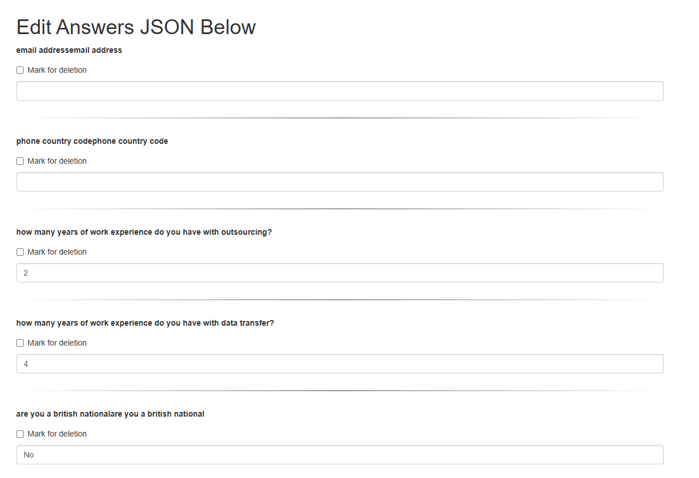

# Answer Editor and Cleaner

This project consists of two main Python scripts: `answer_editor.py` and `cleanse_answers.py`. These scripts work together to manage and clean a set of questions and answers stored in JSON format.

## answer_editor.py

This script is a Flask web application that provides a user interface for viewing and editing a set of questions and answers.

### Key Features:
- Utilizes Flask and Flask-Bootstrap for an intuitive web interface.
- Reads and writes data to a JSON file (`answers.json`).
- Allows users to:
  - View all questions and answers.
  - Edit existing answers (supports both radio button and text input types).
  - Delete individual question-answer pairs.

### How it Works:
1. The main route (`/`) displays all questions and answers via a GET request.
2. On a POST request (e.g., form submission), it updates the answers in the JSON file.
3. The web interface is rendered using a template (`index.html`).

---

## cleanse_answers.py

This script is designed to clean and sanitize the questions and answers stored in the JSON file.

### Key Features:
- Removes duplicate words in questions.
- Converts text to lowercase for consistency.
- Cleans unnecessary characters and common suffixes.
- Removes non-ASCII characters to ensure compatibility.
- Eliminates duplicate questions from the dataset.

### How it Works:
1. Reads the input JSON file (`answers.json`).
2. Sanitizes each question using the `sanitize_text` function.
3. Filters out duplicate questions.
4. Writes the cleansed data to a new JSON file (`cleansed_answers.json`).

---

## Usage

1. **Run `answer_editor.py`** to start the web application for viewing and editing answers:
   ```bash
   python answer_editor.py
   ```
   Then open a web browser and navigate to [http://localhost:5000](http://localhost:5000).

   **Screenshot Example:**
   

2. **Run `cleanse_answers.py`** after editing answers to sanitize the data:
   ```bash
   python cleanse_answers.py
   ```

   This will generate a new file `cleansed_answers.json` with the cleaned data.


## Requirements

Make sure to have the necessary dependencies installed before running `answer_editor.py`:
```bash
pip install -r requirements.txt
```
