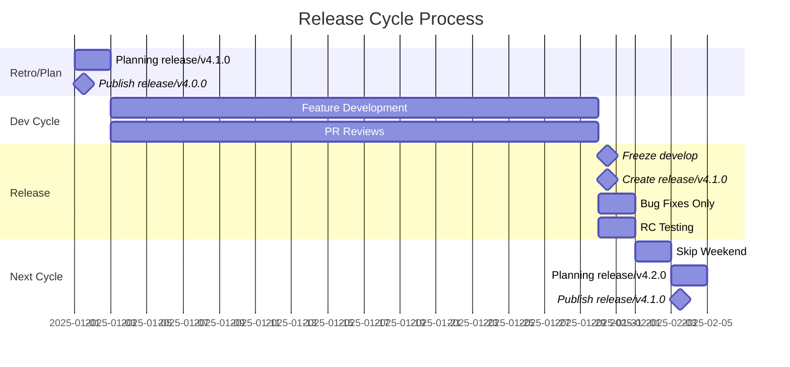

# Contributing to Auto_Jobs_Applier_AIHawk

## Table of Contents

- [Issue Labels](#issue-labels)
- [Bug Reports](#bug-reports)
- [Feature Requests](#feature-requests)
- [Branch Rules](#branch-rules)
- [Version Control](#version-control)
- [Release Process](#release-process)
- [Roles](#roles) 
- [Pull Request Process](#pull-request-process)
- [Code Style Guidelines](#code-style-guidelines)
- [Development Setup](#development-setup)
- [Testing](#testing)
- [Communication](#communication)
- [Development Diagrams](./docs/development_diagrams.md)

Thank you for your interest in contributing to Auto_Jobs_Applier_AIHawk. This document provides guidelines for contributing to the project.

## Issue Labels

The project uses the following labels:

- **bug**: Something isn't working correctly
- **enhancement**: New feature requests
- **good first issue**: Good for newcomers
- **help wanted**: Extra attention needed
- **documentation**: Documentation improvements

## Bug Reports

When submitting a bug report, please include:

- A clear, descriptive title prefixed with [BUG]
- Steps to reproduce the issue
- Expected behavior
- Actual behavior
- Any error messages or screenshots
- Your environment details (OS, Python version, etc.)

## Feature Requests

For feature requests, please:

- Prefix the title with [FEATURE]
- Include a feature summary
- Provide detailed feature description
- Explain your motivation for the feature
- List any alternatives you've considered

## Branch Rules

- `main` - Production-ready code, protected branch
- `develop` - Integration branch for features
- `feature/*` - New features
- `release/*` - Release preparation
- `bugfix/*` - Bug fixes for development
- `hotfix/*` - Emergency production fixes

## Version Control

- Semantic versioning: `vMAJOR.MINOR.PATCH`
- Release tags on `main` branch only
- Package versions match git tags

## Release Process

week one for `release/v4.1.0`

- Planning meeting for `release/v4.1.0` with release scope and milestone objectives set by the maintainers. Release and maintainer meeting agendas and schedules are posted on the project repository [wiki](https://github.com/AIHawk/AIHawk/wiki) and shared in the `#releases` channel on Discord.
- `release/v4.0.0` release candidate ready for release
- `release/v4.0.0` merge into `develop`, `main`
- tag `main` as `release/v4.0.0`
- `release/v4.0.0` published to AIHawk/releases and PyPI as a package with release documentation
- delete `release/v4.0.0` branch

release/v4.1.0 release weeks

- Contributers work on issues and PRs, prioritizing next milestone
- Maintainers review PRs from `feature/*`, `bugfix/*` branches and issues, merging into `develop`
- Maintainers review PRs from `hotfix/*` branches and issues, merged into `main` and `develop`, `main` tagged and merged into `4.0.1` package and `release/v4.0.1` and `release/v4.1.0`, documentation is updated

last week, release candidate

- `develop` is frozen, only bug fixes
- create release branch `release/v4.1.0` from `develop`
- only bug fixes are merged into `release/v4.1.0`
- additional testing and release candidate review

week one is repeated for `release/v4.2.0`

## Roles

### Organization Owner

- Has full access to all repositories
- Controls organization-wide settings and permissions
- Can set base permissions for all members
- Manages repository settings and collaborator access

### Release Manager

- Creates and manages release branch from develop
- Coordinates release cycles and versioning
- Merges release into main

### Maintainer

- Reviews and approves develop, feature PRs
- Triage issues, bugs, PRs
- Manages feature, bugfix PRs merge into develop
- Leads feature development, bug prioritization
- Manages README, CONTRIBUTING, and other documentation

### Moderator

- Moderates Telegram, Discord channels
- Manages project wiki
- Contributes to README, CONTRIBUTING, and other documentation

### Contributor

- Creates feature branches from develop
- Implements new features, bug fixes, and other changes
- creates PRs on features
- Collaborates with other developers on features

## Pull Request Process

1. Fork the repository
2. Create a new branch for your feature or bug
3. Write clear commit messages
4. Update documentation as needed
5. Add tests for new functionality
6. Ensure tests pass
7. Submit a pull request with a clear description

## Merging Pull Requests

- All PRs are reviewed by maintainers
- At least 2 Maintainers approve PRs for merge
- PRs are merged into `develop`
- PRs are tested and verified to work as expected

## Code Style Guidelines

- Follow PEP 8 standards for Python code
- Include docstrings for new functions and classes
- Add comments for complex logic
- Maintain consistent naming conventions
- Security best practices
- Any performance considerations

## Development Setup

1. Clone the repository
2. Install dependencies from requirements.txt
3. Set up necessary API keys and configurations

## Testing

Before submitting a PR:

- Test your changes thoroughly
- Ensure existing tests pass
- Add new tests for new functionality
- Verify functionality with different configurations

## Communication

- Be respectful and constructive in discussions
- Use clear and concise language
- Reference relevant issues in commits and PRs
- Ask for help when needed

The project maintainers reserve the right to reject any contribution that doesn't meet these guidelines or align with the project's goals.
