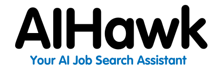

<a name="top"></a>
<div align="center">


<!-- At first glance, the branding and messaging clearly conveys what to expect -->

  <!-- [](https://t.me/AIhawkCommunity) -->

# AIHawk the first Jobs Applier AI Agent

  

**🤖🔍 Your AI-powered job search assistant. Automate applications, get personalized recommendations, and land your dream job faster.**

Join our community: [Telegram](https://t.me/AIhawkCommunity) (for Normal user) | [Discord](https://discord.gg/mMZcMTH9K6) (for Open Source contributors)

[](https://t.me/AIhawkCommunity)
[](https://discord.gg/mMZcMTH9K6)

</div>

**Creator** [feder-cr](https://github.com/feder-cr), Co-Founder of AIHawk </br>
As AIHawk is focusing on their proprietary product - solving problems in hiring for companies, currently this project is led, managed, and maintained by a group of open-source contributors, with a focus on building tools to help job seekers land the jobs they deserve.

**Project Maintainers / Leads**: [surapuramakhil](https://github.com/surapuramakhil), [sarob](https://github.com/sarob), [cjbbb](https://github.com/cjbbb)

We are looking to expand our FOSS maintainers team! If you are from a non-technical background, you can be part of the project management team, triaging issues, and shaping the project. If you are a technical person, you can join in doing code reviews, participating in releases, and buidling better version of this product.

reach out to [surapuramakhil](https://github.com/surapuramakhil) on [Discord](https://discord.gg/mMZcMTH9K6). [Special thanks](#special-thanks) 

Auto_Jobs_Applier_AIHawk is continuously evolving, and your feedback, suggestions, and contributions are highly valued. Feel free to open issues, suggest enhancements, or submit pull requests to help improve the project. Let's work together to make Auto_Jobs_Applier_AIHawk a powerful tool for job seekers worldwide.

## Table of Contents

1. [Introduction](#introduction)
2. [Features](#features)
3. [Installation](#installation)
4. [Configuration](#configuration)
5. [Usage](#usage)
6. [Documentation](#documentation)
7. [Troubleshooting](#troubleshooting)
8. [Conclusion](#conclusion)
9. [Contributors](#contributors)
10. [License](#license)
11. [Disclaimer](#disclaimer)

## Introduction

Auto_Jobs_Applier_AIHawk is a cutting-edge, automated tool designed to revolutionize the job search and application process. In today's fiercely competitive job market, where opportunities can vanish in the blink of an eye, this program offers job seekers a significant advantage. By leveraging the power of automation and artificial intelligence, Auto_Jobs_Applier_AIHawk enables users to apply to a vast number of relevant positions efficiently and in a personalized manner, maximizing their chances of landing their dream job.

### The Challenge of Modern Job Hunting

In the digital age, the job search landscape has undergone a dramatic transformation. While online platforms have opened up a world of opportunities, they have also intensified competition. Job seekers often find themselves spending countless hours scrolling through listings, tailoring applications, and repetitively filling out forms. This process can be not only time-consuming but also emotionally draining, leading to job search fatigue and missed opportunities.

### Enter Auto_Jobs_Applier_AIHawk: Your Personal Job Search Assistant

Auto_Jobs_Applier_AIHawk steps in as a game-changing solution to these challenges. It's not just a tool; it's your tireless, 24/7 job search partner. By automating the most time-consuming aspects of the job search process, it allows you to focus on what truly matters - preparing for interviews and developing your professional skills.

## Features

1. **Intelligent Job Search Automation**
   - Customizable search criteria
   - Continuous scanning for new openings
   - Smart filtering to exclude irrelevant listings

2. **Rapid and Efficient Application Submission**
   - One-click applications
   - Form auto-fill using your profile information
   - Automatic document attachment (resume, cover letter)

3. **AI-Powered Personalization**
   - Dynamic response generation for employer-specific questions
   - Tone and style matching to fit company culture
   - Keyword optimization for improved application relevance

4. **Volume Management with Quality**
   - Bulk application capability
   - Quality control measures
   - Detailed application tracking

5. **Intelligent Filtering and Blacklisting**
   - Company blacklist to avoid unwanted employers
   - Title filtering to focus on relevant positions

6. **Dynamic Resume Generation**
   - Automatically creates tailored resumes for each application
   - Customizes resume content based on job requirements

7. **Secure Data Handling**
   - Manages sensitive information securely using YAML files

## Installation

**Confirmed successful runs on the following:**

- Operating Systems:
  - Windows 10
  - Ubuntu 22
- Python versions:
  - 3.10
  - 3.11.9(64b)
  - 3.12.5(64b)

### Option 1: Using Python Virtual Environment 

1. **Download and Install Python:**

   Ensure you have the last Python version  installed. If not, download and install it from Python's official website. For detailed instructions, refer to the tutorials:

   - [How to Install Python on Windows](https://www.geeksforgeeks.org/how-to-install-python-on-windows/)
   - [How to Install Python on Linux](https://www.geeksforgeeks.org/how-to-install-python-on-linux/)
   - [How to Download and Install Python on macOS](https://www.geeksforgeeks.org/how-to-download-and-install-python-latest-version-on-macos-mac-os-x/)

2. **Download and Install Google Chrome:**
   - Download and install the latest version of Google Chrome in its default location from the [official website](https://www.google.com/chrome).

3. **Clone the repository:**

   ```bash
   git clone https://github.com/feder-cr/Auto_Jobs_Applier_AIHawk.git
   
   cd Auto_Jobs_Applier_AIHawk
   ```

4. **Activate virtual environment:**

   ```bash
   python3 -m venv virtual
   ```

   ```bash
   source virtual/bin/activate
   ```

   or for Windows-based machines -

   ```bash
   .\virtual\Scripts\activate
   ```

5. **Install the required packages:**

   ```bash
   pip install -r requirements.txt
   ```

### Option 2: Using Conda 

1. **Install Conda:**
   - Download and install Miniconda from the [official website](https://docs.conda.io/en/latest/miniconda.html)
   - Or install Anaconda from the [Anaconda website](https://www.anaconda.com/download)

2. **Create and activate conda environment:**
   ```bash
   # Create new environment
   conda create -n aihawk python=3.11

   # Activate environment
   conda activate aihawk
   ```

3. **Clone the repository:**
   ```bash
   git clone https://github.com/feder-cr/Auto_Jobs_Applier_AIHawk.git
   cd Auto_Jobs_Applier_AIHawk
   ```

4. **Install dependencies:**
   ```bash
   # Install from requirements.txt
   pip install -r requirements.txt
   ```
 

## Configuration

### 1. secrets.yaml

This file contains sensitive information. Never share or commit this file to version control.

- `llm_api_key: [Your OpenAI or Ollama API key or Gemini API key]`
  - Replace with your OpenAI API key for GPT integration
  - To obtain an API key, follow the tutorial at: <https://medium.com/@lorenzozar/how-to-get-your-own-openai-api-key-f4d44e60c327>
  - Note: You need to add credit to your OpenAI account to use the API. You can add credit by visiting the [OpenAI billing dashboard](https://platform.openai.com/account/billing).
  - According to the [OpenAI community](https://community.openai.com/t/usage-tier-free-to-tier-1/919150) and our users' reports, right after setting up the OpenAI account and purchasing the required credits, users still have a `Free` account type. This prevents them from having unlimited access to OpenAI models and allows only 200 requests per day. This might cause runtime errors such as:  
    `Error code: 429 - {'error': {'message': 'You exceeded your current quota, please check your plan and billing details. ...}}`  
    `{'error': {'message': 'Rate limit reached for gpt-4o-mini in organization <org> on requests per day (RPD): Limit 200, Used 200, Requested 1.}}`  
    OpenAI will update your account automatically, but it might take some time, ranging from a couple of hours to a few days.  
    You can find more about your organization limits on the [official page](https://platform.openai.com/settings/organization/limits).
  - For obtaining Gemini API key visit [Google AI for Devs](https://ai.google.dev/gemini-api/docs/api-key)

### 2. work_preferences.yaml

This file defines your job search parameters and bot behavior. Each section contains options that you can customize:

- `remote: [true/false]`

  - Set to `true` to include remote jobs, `false` to exclude them

- `hybrid: [true/false]`

  - Set to `true` to include hybrid jobs, `false` to exclude them

- `onsite: [true/false]`

  - Set to `true` to include onsite jobs, `false` to exclude them

- `experience_level:`

  - Set desired experience levels to `true`, others to `false`

- `job_types:`
  - Set desired job types to `true`, others to `false`

- `date:`
  - Choose one time range for job postings by setting it to `true`, others to `false`

- `positions:`
  - List job titles you're interested in, one per line
  - Example:

    ```yaml
    positions:
      - Software Developer
      - Data Scientist
    ```

- `locations:`
  - List locations you want to search in, one per line
  - Example:

    ```yaml
    locations:
      - Italy
      - London
    ```

- `apply_once_at_company: [True/False]`
  - Set to `True` to apply only once per company, `False` to allow multiple applications per company

- `distance: [number]`
  - Set the radius for your job search in miles
  - Example: `distance: 50`

- `companyBlacklist:`
  - List companies you want to exclude from your search, one per line
  - Example:

    ```yaml
    companyBlacklist:
      - Company X
      - Company Y
    ```

- `titleBlacklist:`
  - List keywords in job titles you want to avoid, one per line
  - Example:

    ```yaml
    titleBlacklist:
      - Sales
      - Marketing
    ```

#### 2.1 config.py - Customize LLM model endpoint

- `LLM_MODEL_TYPE`:
  - Choose the model type, supported: openai / ollama / claude / gemini
- `LLM_MODEL`:
  - Choose the LLM model, currently supported:
    - openai: gpt-4o
    - ollama: llama2, mistral:v0.3
    - claude: any model
    - gemini: any model
- `LLM_API_URL`:
  - Link of the API endpoint for the LLM model
    - openai: <https://api.pawan.krd/cosmosrp/v1>
    - ollama: <http://127.0.0.1:11434/>
    - claude: <https://api.anthropic.com/v1>
    - gemini: <https://aistudio.google.com/app/apikey>
- Note: To run local Ollama, follow the guidelines here: [Guide to Ollama deployment](https://github.com/ollama/ollama)
  
### 3. plain_text_resume.yaml

This file contains your resume information in a structured format. Fill it out with your personal details, education, work experience, and skills. This information is used to auto-fill application forms and generate customized resumes.

Each section has specific fields to fill out:

- `personal_information:`
  - This section contains basic personal details to identify yourself and provide contact information.
    - **name**: Your first name.
    - **surname**: Your last name or family name.
    - **date_of_birth**: Your birth date in the format DD/MM/YYYY.
    - **country**: The country where you currently reside.
    - **city**: The city where you currently live.
    - **address**: Your full address, including street and number.
    - **zip_code**: Your postal/ZIP code.
    - **phone_prefix**: The international dialing code for your phone number (e.g., +1 for the USA, +44 for the UK).
    - **phone**: Your phone number without the international prefix.
    - **email**: Your primary email address.
    - **github**: URL to your GitHub profile, if applicable.
    - **linkedin**: URL to your LinkedIn profile, if applicable.
  - Example

  ```yaml
  personal_information:
    name: "Jane"
    surname: "Doe"
    date_of_birth: "01/01/1990"
    country: "USA"
    city: "New York"
    address: "123 Main St"
    zip_code: "520123"
    phone_prefix: "+1"
    phone: "5551234567"
    email: "jane.doe@example.com"
    github: "https://github.com/janedoe"
    linkedin: "https://www.linkedin.com/in/janedoe/"
  ```

- `education_details:`
  - This section outlines your academic background, including degrees earned and relevant coursework.
    - **degree**: The type of degree obtained (e.g., Bachelor's Degree, Master's Degree).
    - **university**: The name of the university or institution where you studied.
    - **final_evaluation_grade**: Your Grade Point Average or equivalent measure of academic performance.
    - **start_date**: The start year of your studies.
    - **graduation_year**: The year you graduated.
    - **field_of_study**: The major or focus area of your studies.
    - **exam**: A list of courses or subjects taken along with their respective grades.

  - Example:

  ```yaml
  education_details:
    - education_level: "Bachelor's Degree"
      institution: "University of Example"
      field_of_study: "Software Engineering"
      final_evaluation_grade: "4/4"
      start_date: "2021"
      year_of_completion: "2023"
      exam:
        Algorithms: "A"
        Data Structures: "B+"
        Database Systems: "A"
        Operating Systems: "A-"
        Web Development: "B"
  ```

- `experience_details:`
  - This section details your work experience, including job roles, companies, and key responsibilities.
    - **position**: Your job title or role.
    - **company**: The name of the company or organization where you worked.
    - **employment_period**: The timeframe during which you were employed in the role, using the format MM/YYYY - MM/YYYY.
    - **location**: The city and country where the company is located.
    - **industry**: The industry or field in which the company operates.
    - **key_responsibilities**: A list of major responsibilities or duties you had in the role, e.g. responsibility: "Developed web applications using React and Node.js".
    - **skills_acquired**: Skills or expertise gained through this role, e.g. "React".

  - Example:

  ```yaml
  experience_details:
    - position: "Software Developer"
      company: "Tech Innovations Inc."
      employment_period: "06/2021 - Present"
      location: "San Francisco, CA"
      industry: "Technology"
      key_responsibilities:
        - responsibility: "Developed web applications using React and Node.js"
        - responsibility: "Collaborated with cross-functional teams to design and implement new features"
        - responsibility: "Troubleshot and resolved complex software issues"
      skills_acquired:
        - "React"
        - "Node.js"
        - "Software Troubleshooting"
  ```

- `projects:`
  - Include notable projects you have worked on, including personal or professional projects.
    - **name**: The name or title of the project.
    - **description**: A brief summary of what the project involves or its purpose.
    - **link**: URL to the project, if available (e.g., GitHub repository, website).

  - Example:

    ```yaml
    projects:
      - name: "Weather App"
        description: "A web application that provides real-time weather information using a third-party API."
        link: "https://github.com/janedoe/weather-app"
      - name: "Task Manager"
        description: "A task management tool with features for tracking and prioritizing tasks."
        link: "https://github.com/janedoe/task-manager"
    ```

- `achievements:`
  - Highlight notable accomplishments or awards you have received.
    - **name**: The title or name of the achievement.
    - **description**: A brief explanation of the achievement and its significance.

  - Example:

  ```yaml
  achievements:
    - name: "Employee of the Month"
      description: "Recognized for exceptional performance and contributions to the team."
    - name: "Hackathon Winner"
      description: "Won first place in a national hackathon competition."
  ```

- `certifications:`
  - Include any professional certifications you have earned.
    - name: "PMP"  
      description: "Certification for project management professionals, issued by the Project Management Institute (PMI)"

  - Example:

  ```yaml
  certifications:
    - "Certified Scrum Master"
    - "AWS Certified Solutions Architect"
  ```

- `languages:`
  - Detail the languages you speak and your proficiency level in each.
    - **language**: The name of the language.
    - **proficiency**: Your level of proficiency (e.g., Native, Fluent, Intermediate).

  - Example:

  ```yaml
  languages:
    - language: "English"
      proficiency: "Fluent"
    - language: "Spanish"
      proficiency: "Intermediate"
  ```

- `interests:`

  - Mention your professional or personal interests that may be relevant to your career.
    - **interest**: A list of interests or hobbies.

  - Example:

  ```yaml
  interests:
    - "Machine Learning"
    - "Cybersecurity"
    - "Open Source Projects"
    - "Digital Marketing"
    - "Entrepreneurship"
  ```

- `availability:`
  - State your current availability or notice period.
    - **notice_period**: The amount of time required before you can start a new role (e.g., "2 weeks", "1 month").

  - Example:

  ```yaml
  availability:
    notice_period: "2 weeks"
  ```

- `salary_expectations:`
  - Provide your expected salary range.
    - **salary_range_usd**: The salary range you are expecting, expressed in USD.

  - Example:

  ```yaml
  salary_expectations:
    salary_range_usd: "80000 - 100000"
  ```

- `self_identification:`
  - Provide information related to personal identity, including gender and pronouns.
    - **gender**: Your gender identity.
    - **pronouns**: The pronouns you use (e.g., He/Him, She/Her, They/Them).
    - **veteran**: Your status as a veteran (e.g., Yes, No).
    - **disability**: Whether you have a disability (e.g., Yes, No).
    - **ethnicity**: Your ethnicity.

  - Example:

  ```yaml
  self_identification:
    gender: "Female"
    pronouns: "She/Her"
    veteran: "No"
    disability: "No"
    ethnicity: "Asian"
  ```

- `legal_authorization:`
  - Indicate your legal ability to work in various locations.
    - **eu_work_authorization**: Whether you are authorized to work in the European Union (Yes/No).
    - **us_work_authorization**: Whether you are authorized to work in the United States (Yes/No).
    - **requires_us_visa**: Whether you require a visa to work in the United States (Yes/No).
    - **requires_us_sponsorship**: Whether you require sponsorship to work in the United States (Yes/No).
    - **requires_eu_visa**: Whether you require a visa to work in the European Union (Yes/No).
    - **legally_allowed_to_work_in_eu**: Whether you are legally allowed to work in the European Union (Yes/No).
    - **legally_allowed_to_work_in_us**: Whether you are legally allowed to work in the United States (Yes/No).
    - **requires_eu_sponsorship**: Whether you require sponsorship to work in the European Union (Yes/No).
    - **canada_work_authorization**: Whether you are authorized to work in Canada (Yes/No).
    - **requires_canada_visa**: Whether you require a visa to work in Canada (Yes/No).
    - **legally_allowed_to_work_in_canada**: Whether you are legally allowed to work in Canada (Yes/No).
    - **requires_canada_sponsorship**: Whether you require sponsorship to work in Canada (Yes/No).
    - **uk_work_authorization**: Whether you are authorized to work in the United Kingdom (Yes/No).
    - **requires_uk_visa**: Whether you require a visa to work in the United Kingdom (Yes/No).
    - **legally_allowed_to_work_in_uk**: Whether you are legally allowed to work in the United Kingdom (Yes/No).
    - **requires_uk_sponsorship**: Whether you require sponsorship to work in the United Kingdom (Yes/No).

  - Example:

     ```yaml
    legal_authorization:
    eu_work_authorization: "Yes"
    us_work_authorization: "Yes"
    requires_us_visa: "No"
    requires_us_sponsorship: "Yes"
    requires_eu_visa: "No"
    legally_allowed_to_work_in_eu: "Yes"
    legally_allowed_to_work_in_us: "Yes"
    requires_eu_sponsorship: "No"
    canada_work_authorization: "Yes"
    requires_canada_visa: "No"
    legally_allowed_to_work_in_canada: "Yes"
    requires_canada_sponsorship: "No"
    uk_work_authorization: "Yes"
    requires_uk_visa: "No"
    legally_allowed_to_work_in_uk: "Yes"
    requires_uk_sponsorship: "No"
    ```

- `work_preferences:`
  - Specify your preferences for work arrangements and conditions.
    - **remote_work**: Whether you are open to remote work (Yes/No).
    - **in_person_work**: Whether you are open to in-person work (Yes/No).
    - **open_to_relocation**: Whether you are willing to relocate for a job (Yes/No).
    - **willing_to_complete_assessments**: Whether you are willing to complete job assessments (Yes/No).
    - **willing_to_undergo_drug_tests**: Whether you are willing to undergo drug testing (Yes/No).
    - **willing_to_undergo_background_checks**: Whether you are willing to undergo background checks (Yes/No).

  - Example:

  ```yaml
  work_preferences:
    remote_work: "Yes"
    in_person_work: "No"
    open_to_relocation: "Yes"
    willing_to_complete_assessments: "Yes"
    willing_to_undergo_drug_tests: "No"
    willing_to_undergo_background_checks: "Yes"
  ```

### PLUS. data_folder_example

The `data_folder_example` folder contains a working example of how the files necessary for the bot's operation should be structured and filled out. This folder serves as a practical reference to help you correctly set up your work environment for the job search bot.

#### Contents

Inside this folder, you'll find example versions of the key files:

- `secrets.yaml`
- `config.yaml`
- `plain_text_resume.yaml`

These files are already populated with fictitious but realistic data. They show you the correct format and type of information to enter in each file.

#### Using the data_folder_example

Using this folder as a guide can be particularly helpful for:

1. Understanding the correct structure of each configuration file
2. Seeing examples of valid data for each field
3. Having a reference point while filling out your personal files

## Usage

0. **Account language**
   To ensure the bot works, your account language must be set to English.

1. **Data Folder:**
   Ensure that your data_folder contains the following files:
   - `secrets.yaml`
   - `config.yaml`
   - `plain_text_resume.yaml`

2. **Output Folder:**
    Contains the output of the bot.
    - `data.json` results of the --collect mode
    - `failed.json` failed applications
    - `open_ai_calls.json` all the calls made to the LLM model
    - `skipped.json` applications that were skipped
    - `success.json` successful applications

    **Note:** `answers.json` is not part of the output folder and can be found in the root of the project. It is used to store the answers of the questions asked to the user. Can be used to update the bot with corrected answers. Search for `Select an option`, `0`, `Authorized`, and `how many years of` to verify correct answers.

3. **Run the Bot:**

   Auto_Jobs_Applier_AIHawk offers flexibility in how it handles your pdf resume:

- **Dynamic Resume Generation:**
  If you don't use the `--resume` option, the bot will automatically generate a unique resume for each application. This feature uses the information from your `plain_text_resume.yaml` file and tailors it to each specific job application, potentially increasing your chances of success by customizing your resume for each position.

   ```bash
   python main.py
   ```

- **Using a Specific Resume:**
  If you want to use a specific PDF resume for all applications, place your resume PDF in the `data_folder` directory and run the bot with the `--resume` option:

  ```bash
  python main.py --resume /path/to/your/resume.pdf
  ```

- **Using the collect mode:**
  If you want to collect job data only to perform any type of data analytics you can use the bot with the `--collect` option. This will store in output/data.json file all data found from linkedin jobs offers.

  ```bash
  python main.py --collect
  ```

### Troubleshooting

#### 1. OpenAI API Rate Limit Errors

**Error Message:**

openai.RateLimitError: Error code: 429 - {'error': {'message': 'You exceeded your current quota, please check your plan and billing details. For more information on this error, read the docs: <https://platform.openai.com/docs/guides/error-codes/api-errors>.', 'type': 'insufficient_quota', 'param': None, 'code': 'insufficient_quota'}}

**Solution:**

- Check your OpenAI API billing settings at <https://platform.openai.com/account/billing>
- Ensure you have added a valid payment method to your OpenAI account
- Note that ChatGPT Plus subscription is different from API access
- If you've recently added funds or upgraded, wait 12-24 hours for changes to take effect
- Free tier has a 3 RPM limit; spend at least $5 on API usage to increase

#### 2. Easy Apply Button Not Found

**Error Message:**

Exception: No clickable 'Easy Apply' button found

**Solution:**

- Ensure that you're logged properly
- Check if the job listings you're targeting actually have the "Easy Apply" option
- Verify that your search parameters in the `config.yaml` file are correct and returning jobs with the "Easy Apply" button
- Try increasing the wait time for page loading in the script to ensure all elements are loaded before searching for the button

#### 3. Incorrect Information in Job Applications

**Issue:** Bot provides inaccurate data for experience, CTC, and notice period

**Solution:**

- Update prompts for professional experience specificity
- Add fields in `config.yaml` for current CTC, expected CTC, and notice period
- Modify bot logic to use these new config fields

#### 4. YAML Configuration Errors

**Error Message:**

yaml.scanner.ScannerError: while scanning a simple key

**Solution:**

- Copy example `config.yaml` and modify gradually
- Ensure proper YAML indentation and spacing
- Use a YAML validator tool
- Avoid unnecessary special characters or quotes

#### 5. Bot Logs In But Doesn't Apply to Jobs

**Issue:** Bot searches for jobs but continues scrolling without applying

**Solution:**

- Check for security checks or CAPTCHAs
- Verify `config.yaml` job search parameters
- Ensure your account profile meets job requirements
- Review console output for error messages

### General Troubleshooting Tips

- Use the latest version of the script
- Verify all dependencies are installed and updated
- Check internet connection stability
- Clear browser cache and cookies if issues persist

For further assistance, please create an issue on the [GitHub repository](https://github.com/feder-cr/Auto_Jobs_Applier_AIHawk/issues) with detailed information about your problem, including error messages and your configuration (with sensitive information removed).

## Documentation

### For Users

- Ollama & Gemini Setup
  - To install and configure **Ollama** and **Gemini**, [Download Ollama and Gemini Setup Guide (PDF)](https://github.com/feder-cr/Auto_Jobs_Applier_AIHawk/blob/main/docs/guide_to_setup_ollama_and_gemini.pdf)
  - Follow the instructions in these guides to ensure proper configuration of **AIHawk** with **Ollama** and **Gemini**.
  - Written by Rushi, [Linkedin](https://www.linkedin.com/in/rushichaganti/), support him by following.

- Editing YAML Files
  - For detailed instructions on editing YAML configuration sections for **AIHawk**, refer to this document:
  - [Download YAML Editing Guide (PDF)](https://github.com/feder-cr/Auto_Jobs_Applier_AIHawk/blob/main/docs/guide_yaml_sections.pdf)
  - Written by Rushi, [Linkedin](https://www.linkedin.com/in/rushichaganti/), support him by following.

- Auto-start AIHawk
  - To make **AIHawk** automatically start when your system boots, follow the steps in this guide:
  - [Download Auto-start AIHawk Guide (PDF)](https://github.com/feder-cr/Auto_Jobs_Applier_AIHawk/blob/main/docs/guide_to_autostart_aihawk.pdf)
  - Written by Rushi, [Linkedin](https://www.linkedin.com/in/rushichaganti/), support him by following.

- Video Tutorial
  - [How to set up Auto_Jobs_Applier_AIHawk](https://youtu.be/gdW9wogHEUM)
  - Written by Rushi, [Linkedin](https://www.linkedin.com/in/rushichaganti/), support him by following.

- [OpenAI API Documentation](https://platform.openai.com/docs/)

### For Developers

- [Contribution Guidelines](CONTRIBUTING.md)

- [Lang Chain Developer Documentation](https://python.langchain.com/v0.2/docs/integrations/components/)

- [Workflow diagrams](docs/workflow_diagrams.md)

- If you encounter any issues, you can open an issue on [GitHub](https://github.com/feder-cr/Auto_Jobs_Applier_AIHawk/issues).
  Please add valuable details to the subject and to the description. If you need new feature then please reflect this.  
  I'll be more than happy to assist you!

- Note for Contributors: If you would like to submit a Pull Request (PR), please target the `release` branch instead of `main`. The `release` branch is used for testing new code changes and will be periodically merged into `main` after validation. This approach ensures that only tested features make it into the main branch.

## Conclusion

Auto_Jobs_Applier_AIHawk provides a significant advantage in the modern job market by automating and enhancing the job application process. With features like dynamic resume generation and AI-powered personalization, it offers unparalleled flexibility and efficiency. Whether you're a job seeker aiming to maximize your chances of landing a job, a recruiter looking to streamline application submissions, or a career advisor seeking to offer better services, Auto_Jobs_Applier_AIHawk is an invaluable resource. By leveraging cutting-edge automation and artificial intelligence, this tool not only saves time but also significantly increases the effectiveness and quality of job applications in today's competitive landscape.

## Star History

[](https://star-history.com/#feder-cr/Auto_Jobs_Applier_AIHawk&Date)

If you like the project please star ⭐ the repository!

## Special Thanks
[](https://github.com/feder-cr/Auto_Jobs_Applier_AIHawk/graphs/contributors)

<a href="https://github.com/AIHawk-co/Auto_Jobs_Applier/graphs/contributors">
  
</a>

Made with [contrib.rocks](https://contrib.rocks).

## License

This project is licensed under the AGPL License. Documentation is licensed under CC BY - see the [AGPL LICENSE](LICENSE) and [CC BY LICENSE](docs/LICENSE) files for details.

The AGPL License requires that any derivative work must also be open source and distributed under the same license.

The CC BY License permits others to distribute, remix, adapt, and build upon your work, even for commercial purposes, as long as they credit you for the original creation. 
 

## Disclaimer

This tool, Auto_Jobs_Applier_AIHawk, is intended for use at your own risk. The creators / maintainers / contributors assume no responsibility for any consequences arising from its use. Users are advised to comply with the terms of service of relevant platforms and adhere to all applicable laws, regulations, and ethical guidelines. The use of automated tools for job applications may carry risks, including potential impacts on user accounts. Proceed with caution and at your own discretion.

[Back to top 🚀](#top)
