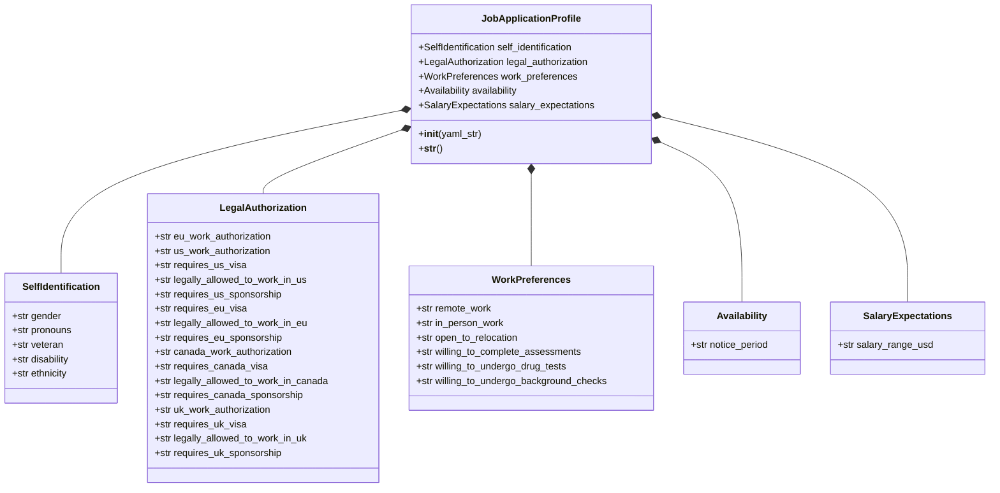
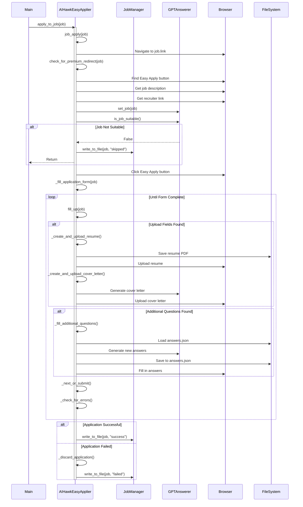

# AIHawk Development Diagrams

## JobApplicationProfile class

```mermaid
classDiagram
    JobApplicationProfile *-- SelfIdentification
    JobApplicationProfile *-- LegalAuthorization
    JobApplicationProfile *-- WorkPreferences
    JobApplicationProfile *-- Availability
    JobApplicationProfile *-- SalaryExpectations

    class JobApplicationProfile {
        +SelfIdentification self_identification
        +LegalAuthorization legal_authorization
        +WorkPreferences work_preferences
        +Availability availability
        +SalaryExpectations salary_expectations
        +__init__(yaml_str)
        +__str__()
    }

    class SelfIdentification {
        +str gender
        +str pronouns
        +str veteran
        +str disability
        +str ethnicity
    }

    class LegalAuthorization {
        +str eu_work_authorization
        +str us_work_authorization
        +str requires_us_visa
        +str legally_allowed_to_work_in_us
        +str requires_us_sponsorship
        +str requires_eu_visa
        +str legally_allowed_to_work_in_eu
        +str requires_eu_sponsorship
        +str canada_work_authorization
        +str requires_canada_visa
        +str legally_allowed_to_work_in_canada
        +str requires_canada_sponsorship
        +str uk_work_authorization
        +str requires_uk_visa
        +str legally_allowed_to_work_in_uk
        +str requires_uk_sponsorship
    }

    class WorkPreferences {
        +str remote_work
        +str in_person_work
        +str open_to_relocation
        +str willing_to_complete_assessments
        +str willing_to_undergo_drug_tests
        +str willing_to_undergo_background_checks
    }

    class Availability {
        +str notice_period
    }

    class SalaryExpectations {
        +str salary_range_usd
    }
```

## Job application process

```mermaid
sequenceDiagram
    participant Main
    participant AIHawkEasyApplier
    participant JobManager
    participant GPTAnswerer
    participant Browser
    participant FileSystem

    Main->>AIHawkEasyApplier: apply_to_job(job)
    activate AIHawkEasyApplier
    
    AIHawkEasyApplier->>AIHawkEasyApplier: job_apply(job)
    AIHawkEasyApplier->>Browser: Navigate to job.link
    
    AIHawkEasyApplier->>AIHawkEasyApplier: check_for_premium_redirect(job)
    
    AIHawkEasyApplier->>Browser: Find Easy Apply button
    AIHawkEasyApplier->>Browser: Get job description
    AIHawkEasyApplier->>Browser: Get recruiter link
    
    AIHawkEasyApplier->>GPTAnswerer: set_job(job)
    AIHawkEasyApplier->>GPTAnswerer: is_job_suitable()
    
    alt Job Not Suitable
        GPTAnswerer-->>AIHawkEasyApplier: False
        AIHawkEasyApplier->>JobManager: write_to_file(job, "skipped")
        AIHawkEasyApplier-->>Main: Return
    end

    AIHawkEasyApplier->>Browser: Click Easy Apply button
    
    AIHawkEasyApplier->>AIHawkEasyApplier: _fill_application_form(job)
    
    loop Until Form Complete
        AIHawkEasyApplier->>AIHawkEasyApplier: fill_up(job)
        
        alt Upload Fields Found
            AIHawkEasyApplier->>AIHawkEasyApplier: _create_and_upload_resume()
            AIHawkEasyApplier->>FileSystem: Save resume PDF
            AIHawkEasyApplier->>Browser: Upload resume
            
            AIHawkEasyApplier->>AIHawkEasyApplier: _create_and_upload_cover_letter()
            AIHawkEasyApplier->>GPTAnswerer: Generate cover letter
            AIHawkEasyApplier->>Browser: Upload cover letter
        end
        
        alt Additional Questions Found
            AIHawkEasyApplier->>AIHawkEasyApplier: _fill_additional_questions()
            AIHawkEasyApplier->>FileSystem: Load answers.json
            AIHawkEasyApplier->>GPTAnswerer: Generate new answers
            AIHawkEasyApplier->>FileSystem: Save to answers.json
            AIHawkEasyApplier->>Browser: Fill in answers
        end
        
        AIHawkEasyApplier->>AIHawkEasyApplier: _next_or_submit()
        AIHawkEasyApplier->>AIHawkEasyApplier: _check_for_errors()
    end
    
    alt Application Successful
        AIHawkEasyApplier->>JobManager: write_to_file(job, "success")
    else Application Failed
        AIHawkEasyApplier->>AIHawkEasyApplier: _discard_application()
        AIHawkEasyApplier->>JobManager: write_to_file(job, "failed")
    end
    
    deactivate AIHawkEasyApplier
```
