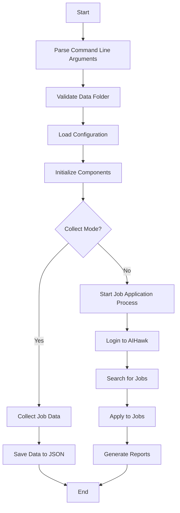
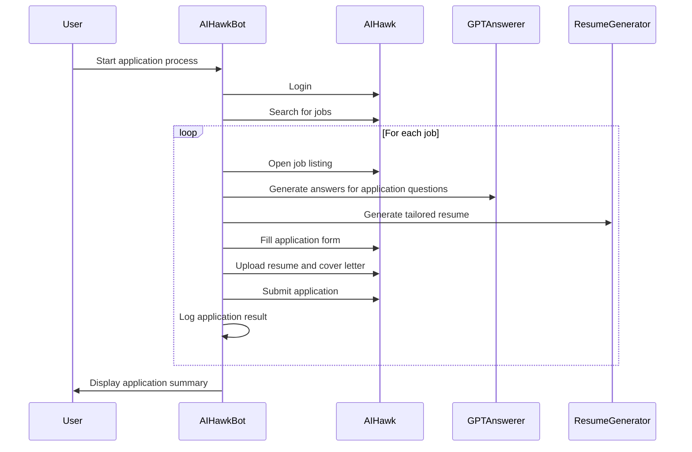
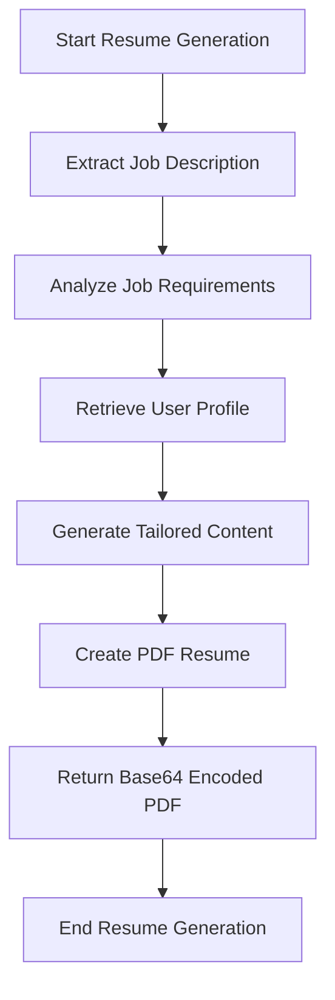
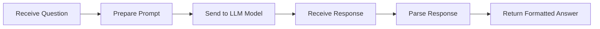

# Dev diagrams

Note: All diagrams are created using [Mermaid](https://mermaid.js.org/).

## 1. Application flow

## 2. Job application process

## 3. Resume generation process

## 4. GPTAnswerer workflow

